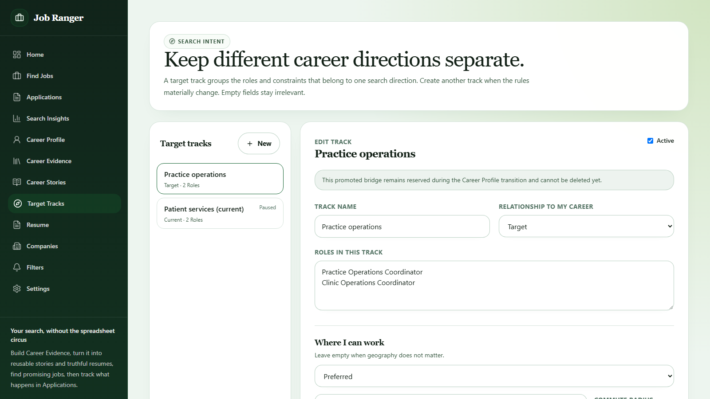
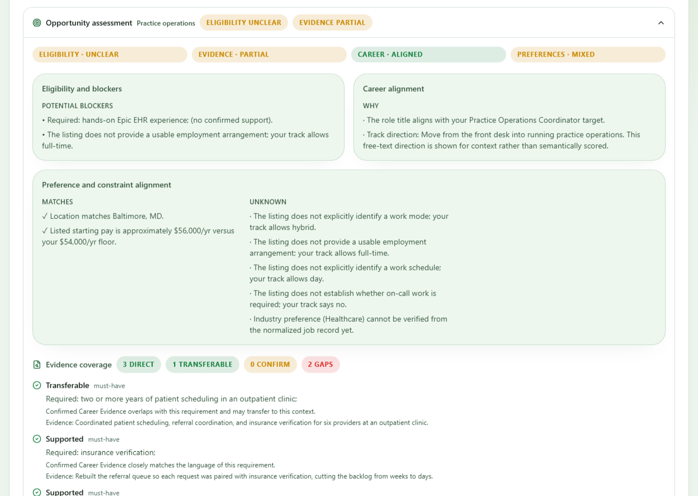
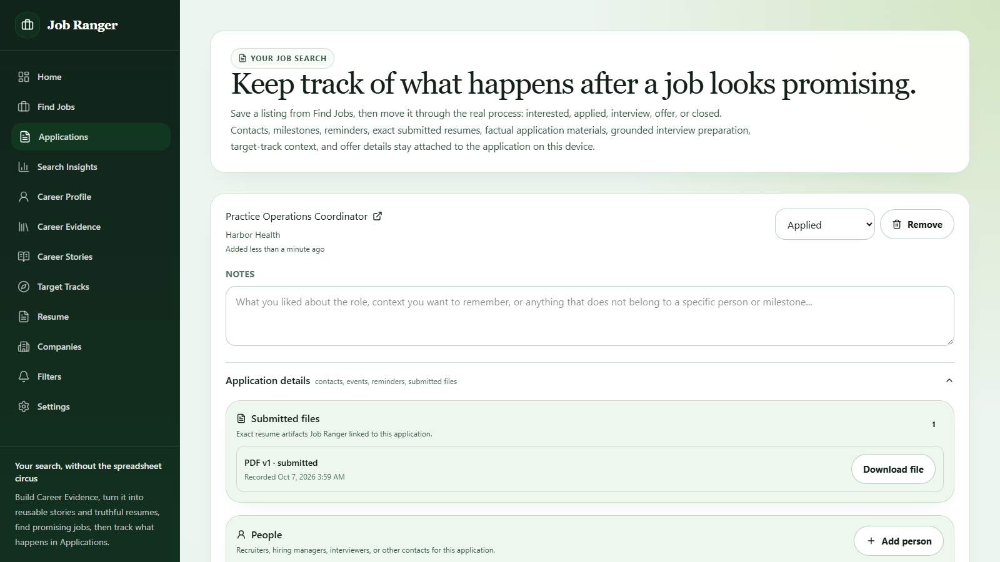

<p align="center">
  
</p>

# Job Ranger

<p align="center">
  <strong>A local-first Career Ops companion for understanding where you want to go, finding the right paths to employment, preparing truthful materials, and managing a focused search without turning your career into somebody else's cloud product.</strong>
</p>

<p align="center">
  <a href="https://github.com/MythologIQ-Labs-LLC/job-ranger/releases/tag/v1.2.0"></a>
  
  <a href="./LICENSE"></a>
</p>

<p align="center">
  <strong>Open source · local first · no account required · no mass auto-apply</strong>
</p>

<p align="center">
  Maintained by <strong>MythologIQ Labs, LLC</strong>.
</p>

## What Job Ranger can do for you

Job Ranger is for people who want help making a **better job-search decision**, not merely sending more applications.

It can help you:

- define the roles, environments, locations, compensation, schedules, and constraints that actually fit what you want next;
- turn a resume, pasted history, or direct entry into a factual **Career Evidence** record you can review and correct;
- discover opportunities and keep the original job evidence that Job Ranger used;
- evaluate a role using separate signals for eligibility, evidence coverage, career-track alignment, preferences, blockers, and unknowns;
- build evidence-backed resumes and application materials without inventing qualifications;
- track applications, contacts, milestones, reminders, interviews, offers, and the exact materials you submitted;
- prepare for interviews using your real experience and the actual requirements of the role;
- learn from recurring gaps and search outcomes without treating application count as progress;
- keep the core workflow on your own machine and useful without an AI subscription or Job Ranger account.

Job Ranger deliberately does **not** mass-apply, fabricate qualifications or relationships, silently upload your career history, or turn one opaque score into hiring truth.

### A typical workflow

> **Person → Career Direction → Companies → People → Opportunities → Applications**

You can enter anywhere in that flow. A resume is evidence about work you have done, not an instruction to keep doing the same thing forever.

### See it in action

These screenshots and the walkthrough video come from the production web build with fictional sample data (Morgan Rivera, Harbor Health). No real person's career data is shown.

**[Watch or download the 85-second walkthrough (WebM)](./docs/assets/demo/job-ranger-demo.webm)**: choosing a direction, assessing a listing, checking Career Evidence, preparing a truthful resume, and tracking the application.

**Choose a direction.** Target tracks keep your current path and the one you are moving toward separate, each with its own roles and constraints.



**Judge a listing on the evidence.** The opportunity assessment reports eligibility, evidence, career alignment, and preferences separately, and names the blockers and unknowns instead of hiding them in one score.



**Apply deliberately.** A resume drafted from confirmed evidence passes the Truth Gate, and the exact exported PDF stays attached to the application you track.



To record the walkthrough again locally, run `npm run demo:record`; regenerate these screenshots with `npm run demo:screenshots`.

## Start here

Job Ranger's **forward distribution model is the PWA plus the Microsoft Store**. The native installers published with v1.2.0 remain immutable historical release artifacts; they are not the product's long-term ordinary-user installation strategy.

| What you want to do | Best current path | Status |
| --- | --- | --- |
| **Evaluate the current product today** | Run the current PWA locally | Implemented and tested in Chromium. Self-hosting currently requires Node.js/npm and a few terminal commands. |
| **Use Job Ranger as an ordinary Windows user** | Microsoft Store package | Implemented and validated in CI; Partner Center submission/certification is still pending. |
| **Use Job Ranger cross-platform without developer setup** | Production PWA/web origin | Implemented; public deployment and broader browser/device validation are still pending. |
| **Inspect the last published desktop release** | v1.2.0 GitHub Release | Historical Windows/macOS binaries remain available and immutable, but they are unsigned/unnotarized and are not the forward mainstream channel. |

For current local evaluation, use the [Self-hosting guide](./docs/SELF_HOSTING.md). For exact distribution architecture and trust boundaries, see [Distribution Architecture](./docs/design/DISTRIBUTION_ARCHITECTURE.md) and [Distribution Trust](./docs/DISTRIBUTION_TRUST.md).

## Release status

The latest published GitHub release is **v1.2.0**, published October 5, 2026. It is preserved as immutable release history.

The active development line is **v1.3.0 candidate preparation**. It contains the current PWA runtime, Microsoft Store packaging, portable Job Ranger archives between runtimes, Windows portability fixes, the corrected web layout, and the public demo/readme work. Those capabilities are implemented in the repository but are not a stable public release until the release gates are satisfied.

### Forward distribution

| Channel | Current state | Intended role |
| --- | --- | --- |
| **PWA / web runtime** | Implemented; Chromium-tested; local self-host path available; production origin not yet promoted | Primary cross-platform distribution |
| **Microsoft Store** | AppX packaging implemented and validated in CI; certification/listing pending | Primary native Windows distribution |
| **Direct native GitHub binaries** | Historical v1.2.0 release plus advanced/test artifacts where useful | Not the preferred ordinary-user path |
| **Native macOS package** | Historical v1.2.0 artifacts only; future native distribution not planned | macOS served by the PWA |
| **Native Linux package** | Not implemented as a supported product channel | Linux served by the PWA unless demand later justifies a separate package |

A future production PWA may be delivered from a normal HTTPS website. That does not change the local-first authority model: browser delivery is not permission to make the server authoritative for Career Evidence or other personal career data.

Job Ranger uses status terms deliberately:

| Status | Meaning |
| --- | --- |
| **Published / stable** | Present in a stable GitHub Release or promoted normal-user distribution channel. |
| **Packaged candidate** | Built and validated as a release artifact, but not yet promoted as stable. |
| **Implemented** | Present in the repository/current development line, but not necessarily publicly distributed. |
| **Candidate / next** | Evidence-backed possible future work, not a commitment. |
| **Deferred** | Intentionally inactive. |
| **Historical** | Retained for provenance, compatibility, or release history. |

For the reconciled factual state, see [System State](./docs/SYSTEM_STATE.md), [Changelog](./CHANGELOG.md), and [v1.3.0 candidate evidence](./docs/validation/RELEASE_CANDIDATE_V1.3.0.md).

## Run the current PWA locally

The current development line can run as a persistent local PWA in a Chromium desktop browser. This is the best way to evaluate the current product before a production web origin or Microsoft Store listing is promoted.

It does **not** require a Job Ranger account, a separate database server, Docker, an AI subscription, or the historical unsigned desktop installer. Local self-hosting does currently require Node.js 22.12.0 or newer, npm, and either Git or a downloaded source archive.

The complete beginner-friendly steps are in [SELF_HOSTING.md](./docs/SELF_HOSTING.md).

~~~bash
git clone https://github.com/MythologIQ-Labs-LLC/job-ranger.git
cd job-ranger
npm ci
npm run selfhost:pwa
~~~

Then open **http://localhost:4174** and install the PWA from Chrome or Edge if desired.

Important persistence rules:

- Keep using the exact http://localhost:4174 origin. Job Ranger deliberately refuses silent port fallback because browser storage is origin-bound.
- Application updates replace the application shell, not your Career Ops data. The PWA stores its SQLite database and managed artifacts in browser-local OPFS.
- Before meaningful upgrades or experiments, export a portable .jobranger backup from Job Ranger. The archive is the supported recovery and later localhost-to-production-origin migration path.
- Do not clear this site's browser storage unless you intend to remove the local Job Ranger profile.
- Firefox, Safari, and broader real-device installability remain validation work before the PWA is promoted as the mainstream public channel.

The implementation and persistence guarantees are documented in [PWA_RUNTIME.md](./docs/design/PWA_RUNTIME.md).

### Historical v1.2.0 desktop release

The [v1.2.0 GitHub Release](https://github.com/MythologIQ-Labs-LLC/job-ranger/releases/tag/v1.2.0) remains available as immutable release history. It contains Windows x64 and macOS x64/arm64 desktop packages promoted byte-for-byte from the validated rc.5 artifacts.

Those binaries are **unsigned/unnotarized** and are no longer the forward ordinary-user distribution strategy. They should not be confused with the pending Microsoft Store channel or the current PWA work. Job Ranger does not recommend disabling Smart App Control, SmartScreen, Defender, Gatekeeper, or equivalent platform protections globally.

Historical package evidence and bounded tester guidance remain in [TESTER_INSTALLATION.md](./docs/TESTER_INSTALLATION.md), [DISTRIBUTION_TRUST.md](./docs/DISTRIBUTION_TRUST.md), and [CLEAN_MACHINE_TRUST_VALIDATION.md](./docs/CLEAN_MACHINE_TRUST_VALIDATION.md).

## What Job Ranger is

Job searching contains an absurd amount of clerical work. People repeatedly check the same sources, lose track of opportunities, rewrite the same career facts, forget which resume they submitted, and maintain increasingly haunted collections of tabs, notes, spreadsheets, and half-finished documents.

Job Ranger is designed around **quality over quantity**: understanding the person behind the resume, identifying career directions worth pursuing, finding companies and opportunities that fit those directions, and helping the user choose a useful path to employment rather than maximizing application throughput.

The guiding progression is:

> **Person → Career Direction → Companies → People → Opportunities → Applications**

A user may enter anywhere in that chain. The resume is useful evidence about prior work, not a command to keep repeating it and not the sole definition of who the user is.

Job Ranger is designed to make the workflow coherent while preserving user authority:

1. describe what kind of work, environment, constraints, and direction you actually want;
2. build a factual Career Evidence record from a resume or direct entry;
3. discover and monitor employers, sources, and opportunities that fit those directions;
4. assess which opportunities deserve attention using explicit requirements, evidence, constraints, preferences, and unknowns;
5. prepare evidence-backed resumes and application materials for opportunities the user intentionally chooses to pursue;
6. track the exact materials, people, events, reminders, interviews, offers, and outcomes around each application;
7. learn from recurring gaps and observed results without pretending correlation is destiny or application count is progress;
8. keep the core workflow local and useful without an AI provider.

Broader Career Ops company-targeting and relationship-path behavior has a completed bounded design contract under #121, but it is **not implemented on the current development line**.

Job Ranger does **not** autonomously mass-apply, invent qualifications or relationships, silently transmit career data to an inference provider, optimize for raw application volume, or treat one opaque score as hiring truth.

## Current capabilities

This is the current product line, not a comparison against obsolete releases.

| Area | Current capability |
| --- | --- |
| **Career direction** | Multiple Target Tracks keep current, adjacent, stretch, and target directions separate with explicit role and constraint semantics. |
| **Career Evidence** | Resume import and direct authoring feed a factual, reviewable evidence record with provenance, correction, merge/reject/supersede lineage, credentials, projects, achievements, and other supported experience. |
| **Opportunity discovery** | Structured support for Greenhouse, Lever, SmartRecruiters, and Ashby, plus governed detected/browser-backed paths for recognized providers and explicit approval before monitoring discovered sources. |
| **Opportunity assessment** | Eligibility, evidence coverage, career alignment, preference alignment, blockers, and unknowns remain separate instead of collapsing into one opaque score. |
| **Resume preparation** | Deterministic ATS-oriented PDF generation, target-specific tailoring, Truth Gate, Parseability Gate, evidence provenance, versioning, and exact submitted-artifact history. |
| **Application materials** | Evidence-grounded preparation with stale-state detection when supporting Career Evidence changes. |
| **Applications** | Status, notes, contacts, milestones, reminders, follow-ups, submitted files, interview state, offers, and negotiation state. |
| **Interview preparation** | Grounded in the tracked job, confirmed Career Evidence, requirement mappings, and the exact submitted resume. |
| **Career Stories & Search Insights** | Evidence-linked stories plus recurring-gap and observed-outcome analysis without treating correlation as destiny. |
| **Personal Brand (development main)** | A manual-first LinkedIn text workflow now has deterministic draft-readiness guidance, a human-reviewed exact-copy package, locally persisted user-confirmed publication receipts, timestamped manual analytics snapshots, and observed rates. This is development functionality, not an announced public release; no LinkedIn connection, AI generation, direct posting, or automatic collection is implied. [Implementation contract](./docs/design/PERSONAL_BRAND_PUBLISHING_ANALYTICS.md). |
| **Backup & portability** | Verified backup/staged restore, JSON Resume interoperability, and a portable .jobranger archive for moving between supported desktop/PWA runtimes. |
| **Local-first PWA** | Shared application core in a browser runtime using SQLite WASM + OPFS, browser document parsing, deterministic PDF output, service-worker integrity checks, and explicit update handling. |
| **Windows Store package** | AppX packaging, isolated Store data root, historical desktop-data import, manifest validation, install, and packaged smoke are implemented; Store certification/listing remains external. |
| **Remote inference** | Deferred. Core product decisions and document generation do not require an AI subscription. |
| **OCR for scanned/image-only resumes** | Deferred rather than silently uploading documents to a hosted OCR service. |
| **Native macOS / Linux distribution** | Not part of the forward mainstream architecture. Cross-platform delivery is through the PWA. |
| **Autonomous mass auto-apply** | Explicit non-goal. Consequential external actions remain with the user. |

For release-by-release history, use [CHANGELOG.md](./CHANGELOG.md).

## Core product principles

### Quality over quantity

The product should optimize for **qualified, intentional progress**, not applications sent. A smaller number of well-understood opportunities that fit the user's direction, evidence, constraints, and preferences is preferable to a large queue of weak matches.

Automation should reduce clerical burden and the cost of making good decisions. It should not remove the user's judgment from consequential external actions or convert employers and professional networks into targets for automated volume.

### Career Evidence is factual authority

Career Profile and Target Tracks describe intent. Career Evidence describes what is factually true about the user. Imported information begins as a proposal. Only user-confirmed or user-authored evidence can support factual application claims.

### Preferences are not constraints

Remote preference, compensation target, commute, schedule, employment arrangement, and similar choices retain explicit semantics. A preference does not silently become a blocker.

### Explain uncertainty instead of scoring around it

Job Ranger separates eligibility, evidence coverage, career-track alignment, preference alignment, blockers, and unknowns. Missing job data stays missing instead of becoming fake precision.

### Local first, useful before AI

The core workflow works without an AI account or hosted Job Ranger account. Optional external capabilities must be narrow adapters with explicit disclosure and may not become authorities over career truth.

### User authority

Job Ranger can discover, organize, explain, prepare, remind, preserve, and analyze. Consequential external actions remain with the user.

## Source support and acquisition trust

Job Ranger does not pretend every careers site is equally automatable.

| Support level | Meaning |
| --- | --- |
| `supported` | A structured adapter exists and is the preferred path. |
| `detected` | Job Ranger recognizes a known provider/vendor portal and can attempt its governed extraction path. |
| `browser-required` | A recognized portal requires a constrained rendered-browser path. |
| `manual-review` | No reliable or sufficiently bounded automated path is claimed. |

Current structured adapters are Greenhouse, Lever, SmartRecruiters, and Ashby. Recognized Workday, iCIMS, BambooHR, Taleo, Oracle Careers, Microsoft Careers, and known browser portals use detected or browser-backed paths where applicable.

Arbitrary generic career-site hostnames remain manual-review/non-runnable. In the desktop runtime, governed acquisition uses connection-level address pinning: policy resolves the approved public address set, direct sockets connect only to approved addresses while TLS continues to verify the original hostname, redirects are independently pinned, and isolated browser HTTP/HTTPS traffic is routed through the governed transport. See [SECURITY.md](./SECURITY.md).

Source discovery remains separate from source acquisition. A discovered opportunity or employer is not silently converted into a monitored trusted source; the user approves monitoring explicitly.

## Current architecture

Job Ranger now has one Career Ops product core with two runtime surfaces rather than two independent products.

~~~text
React product UI
  onboarding / targeting / jobs / applications / evidence
  resume / interview prep / stories / insights / settings
                         |
                         v
              typed runtime boundary
                         |
                         v
               shared Career Ops core
  repositories / migrations / domain services / validators
  requirements / assessment / Truth Gate / Parseability Gate
  application lifecycle / backup / interoperability
                 |                    |
                 v                    v
        Electron adapters        PWA adapters
        native SQLite            SQLite WASM + OPFS
        managed files            browser-local artifacts
        OS integration           browser document/PDF paths
        governed acquisition     service worker + web security
~~~

The runtime adapters own platform mechanics; the shared core owns product truth. This avoids letting the Windows app and PWA quietly become different applications with different career logic.

electron/src/** remains the checked-in privileged desktop implementation authority; electron-runtime/** is generated for development, tests, packaging, and execution. The PWA implementation and parity boundary are documented in [PWA_RUNTIME.md](./docs/design/PWA_RUNTIME.md), with the overall architecture in [ARCHITECTURE_PLAN.md](./docs/ARCHITECTURE_PLAN.md).

## Privacy and security posture

Job Ranger is local-first across both runtimes.

The Windows desktop runtime keeps structured career/search state in local SQLite and uses typed IPC boundaries rather than exposing Node.js directly to the renderer. The PWA keeps its database and managed artifacts in browser-local storage using SQLite WASM + OPFS. Delivering the PWA from an HTTPS origin does not make that server authoritative for personal career data.

Security boundaries include sandboxed renderer/browser surfaces, explicit runtime adapters, validated imports, governed acquisition rules, deterministic backup/export integrity, strict web CSP/Trusted Types, service-worker asset verification, and evidence-grounded factual claims.

For ordinary-user distribution going forward:

- **Windows:** trust comes from Microsoft Store certification and Microsoft-managed package signing.
- **Cross-platform web/PWA:** trust comes from the controlled HTTPS origin, browser security boundary, deployment provenance, and service-worker/update integrity.
- **Historical/direct native binaries:** hashes and provenance remain useful evidence, but an unsigned GitHub binary is not equivalent to a Store-certified package.

Remote inference, telemetry, cloud account sync, or credential-bearing external services require explicit future governance and disclosure. See [DISTRIBUTION_TRUST.md](./docs/DISTRIBUTION_TRUST.md) and [SECURITY.md](./SECURITY.md).

## Product gaps and evaluated candidates

Current dispositions live in [PRODUCT_GAP_REVIEW.md](./docs/PRODUCT_GAP_REVIEW.md).

Examples still suitable for future evidence-backed consideration include:

- broader discovery providers, especially government and niche sources;
- easier capture of jobs encountered during normal browsing;
- reusable application-question answers and bounded user-controlled form assistance;
- implementation of the already-bounded Career Ops company/relationship-path design;
- mock-interview practice and feedback;
- calendar mirroring;
- native Linux packaging only if real demand justifies a separate packaging, update, QA, and support surface.

Native macOS distribution is not part of the forward architecture. macOS and Linux are expected to use the cross-platform PWA rather than requiring Job Ranger to maintain separate native installers merely because packaging is technically possible.

## Development

This section is for contributors, maintainers, and people intentionally self-hosting the current development line. It is not the intended long-term ordinary-user installation flow.

### Prerequisites

- Node.js `>=22.12.0`
- npm
- `sqlite3` on `PATH`, or `SQLITE3_PATH` set explicitly

### Core commands

```bash
npm ci
npm run repo:health          # typecheck, desktop + web builds, full test suite
npm run test:unit
npm run test:e2e             # Electron Playwright
npm run electron:dev
npm run electron:build:win   # direct-download NSIS (advanced/test channel)
npm run electron:build:store # Microsoft Store AppX (Windows only)
```

### Web/PWA runtime

```bash
npm run dev:pwa              # development server
npm run build:pwa            # production build -> dist-pwa/
npm run preview:pwa          # serve an existing build at http://localhost:4174
npm run selfhost:pwa         # build + serve the persistent localhost dogfood runtime
npm run test:pwa:e2e         # browser suite (Playwright, Chromium)
npm run test:pwa:engine      # shared-core suites on the SQLite WASM engine
```

## Release engineering

GitHub Releases remain the immutable source of release/tag and artifact provenance. They are not, by themselves, the forward ordinary-user distribution strategy.

The current release line distinguishes:

- **published history:** v1.2.0 remains immutable;
- **current candidate:** v1.3.0 is in release-candidate preparation;
- **Windows ordinary-user channel:** Microsoft Store after Partner Center submission/certification and clean acceptance;
- **cross-platform ordinary-user channel:** the PWA after production-origin and browser/device validation;
- **direct GitHub native binaries:** development, testing, archival, or informed advanced-user artifacts unless they independently satisfy the applicable public trust requirements.

The outstanding external distribution work is Store certification/listing and production PWA promotion/validation, not reviving native macOS as a required release target.

Every promoted release/channel must preserve exact source/build identity, checksums/manifests where applicable, runtime validation, upgrade/backup evidence, and honest status language. No v1.2.0 artifact is ever mutated.

See [RELEASE_READINESS.md](./docs/RELEASE_READINESS.md), [DISTRIBUTION_TRUST.md](./docs/DISTRIBUTION_TRUST.md), and [v1.3.0 candidate evidence](./docs/validation/RELEASE_CANDIDATE_V1.3.0.md).

## Documentation hierarchy

Start with [`docs/README.md`](./docs/README.md).

## Governance, security, and attribution

- [`GOVERNANCE.md`](./GOVERNANCE.md) — decision authority and truth/status language.
- [`SECURITY.md`](./SECURITY.md) — security posture and reporting guidance.
- [`CONTRIBUTING.md`](./CONTRIBUTING.md) — contribution workflow.
- [`CODE_OF_CONDUCT.md`](./CODE_OF_CONDUCT.md) — community expectations.
- [`docs/BRANDING.md`](./docs/BRANDING.md) — canonical visual assets and usage.
- [`TRADEMARKS.md`](./TRADEMARKS.md) — Job Ranger name/mark usage and official-distribution identity.
- [`THIRD_PARTY_NOTICES.md`](./THIRD_PARTY_NOTICES.md) — third-party attribution and provenance.

## License

Job Ranger's current development line is open source under the [GNU Affero General Public License v3.0 only (AGPL-3.0-only)](./LICENSE). Commercial use and paid distribution are permitted, while covered modified versions remain subject to AGPL source-sharing requirements. Historical versions already released under MIT, including v1.2.0, retain their prior MIT grants; see [`LICENSE_HISTORY.md`](./LICENSE_HISTORY.md). The Job Ranger name and official-distribution identity remain governed separately by [`TRADEMARKS.md`](./TRADEMARKS.md). Third-party dependencies and adapted components retain their own obligations as recorded in [`THIRD_PARTY_NOTICES.md`](./THIRD_PARTY_NOTICES.md).
